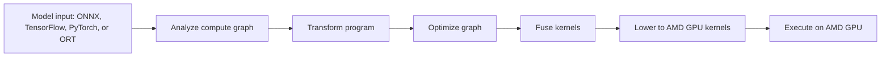
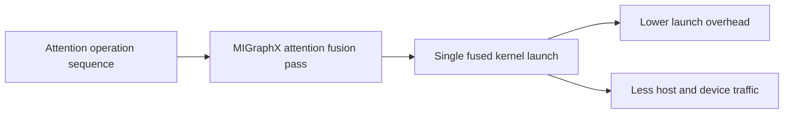

# ROCm Inference Reference

This source disposition reference was retrieved 2026-04-22. It is for
troubleshooting and planning the Strix Halo `gfx1151` inference stack. Upstream
ROCm documents often describe MI300X, MI350X, CDNA, or Instinct systems; treat
those details as `advisory-only` until a local scenario validates them here.

Status labels:

- `validated`: a local host run or package result proves the behavior.
- `planned`: the repo has enough signal to create package or scenario work.
- `advisory-only`: keep the source for future reasoning, but do not act yet.
- `requires-host-validation`: package or scenario work may be useful, but no
  local result exists.

## Source Disposition

| Source | Source type | Retrieved | Validation status | Ingestion destination | Next gate | Notes |
| --- | --- | --- | --- | --- | --- | --- |
| <https://github.com/ROCm/rocm-examples/tree/amd-staging> | upstream GitHub tree, `amd-staging` | 2026-04-22 | `planned` | `docs/maintainers/rocm-inference-reference.md`; `docs/backlog.md` | pick a concrete package or scenario experiment | Wide reference for HIP, MIGraphX, hipBLASLt, Composable Kernel, rocWMMA, rocProfiler, decode, and preprocessing examples. |
| <https://github.com/ROCm/rocm-examples/tree/amd-staging/AI/MIGraphX/Quantization> | upstream GitHub tree, `amd-staging` | 2026-04-22 | `planned` | `docs/backlog.md`; `docs/maintainers/rocm-inference-reference.md` | Torch-MIGraphX source audit | PT2E quantization examples route PyTorch-exported graphs through Torch-MIGraphX and MIGraphX. |
| <https://github.com/ROCm/rocm-examples/blob/amd-staging/AI/MIGraphX/Quantization/Running-Quantized-ResNet50-via-MIGraphX.md> | upstream GitHub doc, `amd-staging` | 2026-04-22 | `requires-host-validation` | `docs/backlog.md`; `docs/maintainers/rocm-inference-reference.md` | ResNet50 PT2E smoke after package exists | Uses `capture_pre_autograd_graph`, `MGXQuantizer`, calibration, `convert_pt2e`, and `torch.compile(..., backend="migraphx")`; not LLM/vLLM proof. |
| <https://github.com/ROCm/torch_migraphx/> | upstream GitHub repo | 2026-04-22 | `validated` | `packages/python-torch-migraphx-gfx1151`; `docs/backlog.md`; `docs/maintainers/rocm-inference-reference.md` | install `python-torch-migraphx-gfx1151 1.2-3`, then add bounded ResNet50 PT2E quantization flow if model/data dependencies are available | Current upstream builds with explicit ROCm compilers. The local package carries PT2E, lazy-Dynamo, AOTAutograd preload, and numpy-metadata patches; installed FX lowering passes on the reference host, and a built `1.2-3` package overlay passes a tiny `torch.compile(..., backend="migraphx")` smoke. |
| <https://rocm.docs.amd.com/projects/AMDMIGraphX/en/latest/conceptual/deep-learning-compilation.html> | upstream ROCm docs | 2026-04-22 | `advisory-only` | `docs/maintainers/rocm-inference-reference.md` | local MIGraphX smoke before runtime claims | Concept source for graph analysis, optimization, fusion, lowering, and PyTorch/ONNX/ORT entry points. |
| <https://github.com/paudley/ai-notes/tree/main/strix-halo> | third-party GitHub notes | 2026-04-22 | `requires-host-validation` | `docs/backlog.md`; `docs/maintainers/current-state.md`; `docs/maintainers/rocm-inference-reference.md` | audit package flags against current PKGBUILDs | Candidate flag reference for `-march=native`, `-famd-opt`, `PYTORCH_ROCM_ARCH`, `ROCM_HOME`, and runtime backend knobs. |
| <https://rocm.docs.amd.com/en/latest/how-to/rocm-for-ai/inference-optimization/model-quantization.html> | upstream ROCm docs | 2026-04-22 | `planned` | `docs/backlog.md`; `docs/maintainers/vllm-recipe-coverage.md`; `docs/maintainers/rocm-inference-reference.md` | add bounded quantization probes | Quark, GPTQ, bitsandbytes, FP8 KV cache, and vLLM quantization entry points. |
| <https://rocm.docs.amd.com/en/latest/how-to/rocm-for-ai/inference-optimization/model-acceleration-libraries.html> | upstream ROCm docs | 2026-04-22 | `planned` | `docs/backlog.md`; `docs/maintainers/rocm-inference-reference.md` | source audit for each package candidate | FlashAttention, xFormers, TunableOp, FBGEMM, and backend-selection guidance. |
| <https://rocm.docs.amd.com/en/latest/how-to/rocm-for-ai/inference-optimization/optimizing-with-composable-kernel.html> | upstream ROCm docs | 2026-04-22 | `advisory-only` | `docs/maintainers/rocm-inference-reference.md` | measured CK bottleneck or package experiment | CK GEMM, batched GEMM, fusion hooks, SmoothQuant INT8 wrappers, and tuning dimensions. |
| <https://rocm.docs.amd.com/en/latest/how-to/rocm-for-ai/inference-optimization/optimizing-triton-kernel.html> | upstream ROCm docs | 2026-04-22 | `advisory-only` | `docs/maintainers/rocm-inference-reference.md` | targeted Triton kernel experiment | Triton and TorchInductor knobs such as block sizes, `waves_per_eu`, `matrix_instr_nonkdim`, and max-autotune. |
| <https://rocm.docs.amd.com/en/latest/how-to/rocm-for-ai/inference-optimization/profiling-and-debugging.html> | upstream ROCm docs | 2026-04-22 | `planned` | `docs/maintainers/rocm-inference-reference.md`; future troubleshooting docs | measured GPU fault or performance issue | PyTorch Profiler, `rocprof`, ROCProfiler SDK, ROCm Compute Profiler, ROCm Systems Profiler, and ROCR Debug Agent. |
| <https://rocm.docs.amd.com/en/latest/how-to/rocm-for-ai/inference-optimization/workload.html> | upstream ROCm docs | 2026-04-22 | `advisory-only` | `docs/maintainers/rocm-inference-reference.md` | measured bottleneck before tuning task | Measure-profile-tune loop, TorchInductor knobs, CK backend notes, hipBLASLt/TensileLite tuning, and MIOpen find modes. |
| <https://rocm.docs.amd.com/en/latest/how-to/rocm-for-ai/inference-optimization/vllm-optimization.html> | upstream ROCm docs | 2026-04-22 | `planned` | `docs/backlog.md`; `docs/maintainers/vllm-recipe-coverage.md`; `docs/maintainers/rocm-inference-reference.md` | bounded vLLM probes with local host results | AITER switches, `--max-num-seqs`, `--max-num-batched-tokens 8192`, default `--gpu-memory-utilization 0.9`, up to `0.95`, FP8 KV cache, Quark, AWQ, GPTQ, and speculative decode guidance. |
| <https://github.com/ROCm/flash-attention> | upstream GitHub repo | 2026-04-22 | `planned` | `docs/backlog.md`; `docs/maintainers/rocm-inference-reference.md` | FlashAttention CK and FlashAttention Triton build/import smokes | ROCm FlashAttention has CK and Triton paths with `FLASH_ATTENTION_TRITON_AMD_ENABLE`, `FLASH_ATTENTION_TRITON_AMD_AUTOTUNE`, `FLASH_ATTENTION_SKIP_CK_BUILD`, and `GPU_ARCHS`. |

## Package And Scenario Impact

- `migraphx-gfx1151` is the local TheRock split for MIGraphX. Do not add a
  duplicate MIGraphX package. The split policy maps real MIGraphX binaries,
  shared libraries, private headers, and Python `migraphx*` modules to this
  package, and the rendered package installs `migraphx.pth` so Python can
  import `/opt/rocm/lib` modules.
- `python-torch-migraphx-gfx1151` now has package policy, build proof, and
  installed host proof for the audited upstream commit that reports version
  `1.2`. Current upstream Torch-MIGraphX builds as a Python 3.14 wheel with
  explicit ROCm compiler bindings. The reference host imports the MIGraphX
  Python module from `migraphx-gfx1151`, lowers a tiny module through FX, and
  runs the same module through `torch.compile(..., backend="migraphx")` from
  the built `1.2-3` package overlay. Install `1.2-3` before treating the Dynamo
  smoke as installed-host proof.
- Add a bounded ResNet50 PT2E quantization flow if its model/data dependencies
  are available.
- Treat ROCm FlashAttention as two experiments:
  - FlashAttention CK: import/build smoke first, then direct CK tests.
  - FlashAttention Triton: build with `FLASH_ATTENTION_TRITON_AMD_ENABLE=TRUE`,
    verify runtime selection, then run a bounded Triton AMD test.
- Track Quark, AWQ, GPTQ, bitsandbytes, FP8 KV-cache, and AITER feature
  switches as vLLM scenario candidates. Keep the existing Qwen3.6 FP8 MoE
  blockers until a backend advertises gfx1151 support and a local run passes.
- Keep xFormers and FBGEMM as package candidates, not package commitments,
  until source audit shows they fit the local ROCm/PyTorch closure.

## MIGraphX Compilation Flow

## Attention Fusion

## Existing Failure Audit

- Qwen3.6 FP8 MoE remains blocked. The ROCm vLLM optimization document adds
  adjacent FP8 KV-cache, Quark, AWQ, GPTQ, and AITER probes, but the current
  `No FP8 MoE backend supports the deployment configuration` and
  `unknown type name 'mfma_adaptor'` failures remain unresolved.
- Gemma 4 AITER FlashAttention remains blocked until the backend gate changes.
  ROCm FlashAttention references inform a standalone package experiment, not
  the existing `ROCM_AITER_FA` failure.
- MIGraphX and Torch-MIGraphX create a compiled graph/quantization lane. They
  do not replace vLLM backend support for long-context LLM serving.
- No affected tracked failure found for profiler-only references. Keep those
  as troubleshooting material until a measured fault or bottleneck appears.
