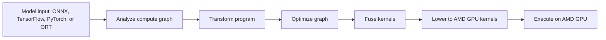
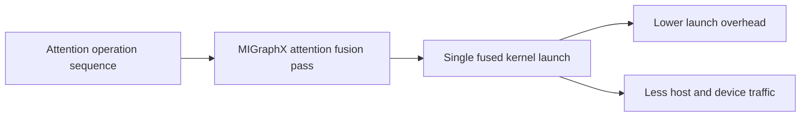

# ROCm Inference Reference

This source disposition reference was compiled from sources retrieved across
2026-04-22, 2026-05-24, the Quark/AWQ/GPTQ/bitsandbytes/xFormers/FBGEMM
candidate triage on 2026-05-26, the 2026-06-01 `amd-quark` authoring-tool
blocker refresh, and the xFormers follow-up, FBGEMM package-boundary review,
and bitsandbytes package-source research. It is for troubleshooting and
planning the Strix Halo `gfx1151` inference stack. Upstream ROCm documents
often describe MI300X, MI350X, CDNA, or Instinct systems; treat those details as
`advisory-only` until a local scenario validates them here.

Some older rows name `docs/backlog.md` as an ingestion destination because that
file was the active queue when the source was reviewed. Those entries are
historical provenance, not current work authority. New actionable package or
scenario work requires an open repository issue; the backlog only indexes
selected issues and explicit non-issue dispositions.

Legacy `planned` and `requires-host-validation` rows without an open issue are
explicit historical, non-issue reference dispositions, not scheduled work.
Promoting one to active execution requires creating an open issue and updating
the row to link it.

Status labels:

- `validated`: a local host run or package result proves the behavior.
- `planned`: the repo has enough signal to create package or scenario work.
- `advisory-only`: keep the source for future reasoning, but do not act yet.
- `requires-host-validation`: package or scenario work may be useful, but no
  local result exists.

## Source Disposition

| Source | Source type | Retrieved | Validation status | Ingestion destination | Next gate | Notes |
| --- | --- | --- | --- | --- | --- | --- |
| <https://github.com/ROCm/rocm-examples/tree/amd-staging> | upstream GitHub tree, `amd-staging` | 2026-04-22 | `planned` | `docs/maintainers/rocm-inference-reference.md`; `docs/backlog.md` | pick a concrete package or scenario experiment | Wide reference for HIP, MIGraphX, hipBLASLt, Composable Kernel, rocWMMA, rocProfiler, decode, and preprocessing examples. |
| <https://github.com/ROCm/rocm-examples/tree/amd-staging/AI/MIGraphX/Quantization> | upstream GitHub tree, `amd-staging` | 2026-04-22 | `planned` | `docs/backlog.md`; `docs/maintainers/rocm-inference-reference.md` | Torch-MIGraphX source audit | PT2E quantization examples route PyTorch-exported graphs through Torch-MIGraphX and MIGraphX. |
| <https://github.com/ROCm/rocm-examples/blob/amd-staging/AI/MIGraphX/Quantization/Running-Quantized-ResNet50-via-MIGraphX.md> | upstream GitHub doc, `amd-staging` | 2026-04-22 | `requires-host-validation` | `docs/backlog.md`; `docs/maintainers/rocm-inference-reference.md` | ResNet50 PT2E smoke after package exists | Uses `capture_pre_autograd_graph`, `MGXQuantizer`, calibration, `convert_pt2e`, and `torch.compile(..., backend="migraphx")`; not LLM/vLLM proof. |
| <https://github.com/ROCm/torch_migraphx/> | upstream GitHub repo | 2026-04-22 | `validated` | `packages/python-torch-migraphx-gfx1151`; `inference/scenarios/torch-migraphx.toml`; `docs/backlog.md`; `docs/maintainers/rocm-inference-reference.md` | optional full ResNet50 PT2E quantization if model/data dependencies are needed | Current upstream builds with explicit ROCm compilers. The local package carries PT2E, lazy-Dynamo, AOTAutograd preload, and numpy-metadata patches; installed FX lowering, PT2E quantizer import, bounded Dynamo ResNet-style compile, and bounded PT2E ResNet-style compile probes pass on the reference host. |
| <https://rocm.docs.amd.com/projects/AMDMIGraphX/en/latest/conceptual/deep-learning-compilation.html> | upstream ROCm docs | 2026-04-22 | `advisory-only` | `docs/maintainers/rocm-inference-reference.md` | local MIGraphX smoke before runtime claims | Concept source for graph analysis, optimization, fusion, lowering, and PyTorch/ONNX/ORT entry points. |
| <https://github.com/paudley/ai-notes/tree/main/strix-halo> | third-party GitHub notes | 2026-04-22 | `requires-host-validation` | `docs/backlog.md`; `docs/maintainers/current-state.md`; `docs/maintainers/rocm-inference-reference.md` | audit package flags against current PKGBUILDs | Candidate flag reference for `-march=native`, `-famd-opt`, `PYTORCH_ROCM_ARCH`, `ROCM_HOME`, and runtime backend knobs. |
| <https://github.com/paudley/ai-notes/blob/3f15f9f1318491c9ee03782d8b2ebd41391de118/strix-halo/QWEN3-VL-EMBED.md> | third-party GitHub note, submodule commit `3f15f9f` | 2026-05-26 | `requires-host-validation` | `docs/maintainers/blackcat-recipe-surfaces.md`; `docs/backlog.md`; `docs/maintainers/rocm-inference-reference.md` | Qwen3-VL helper and scenario lane | Advises Qwen3-VL embedding/reranking W8A16 quantization, ViT FP32 behavior, FP8 E5M2 cache behavior, and `trust_remote_code` model loading. Treat as blocked for scenario promotion until source review and host gates exist. |
| <https://github.com/AtomicBot-ai/atomic-llama-cpp-turboquant/tree/feature/turboquant-kv-cache> | third-party GitHub branch via Blackcat manifest | 2026-05-26 | `advisory-only` | `docs/maintainers/blackcat-recipe-surfaces.md`; `docs/backlog.md`; `docs/maintainers/rocm-inference-reference.md` | user decision plus source-risk review | Blackcat builds this as an evaluation-only Atomic TurboQuant llama.cpp side variant. Do not add package policy without user approval, pinned-ref and license review, package boundary, benchmark target, backend coexistence, and installed scenario gates. |
| <https://rocm.docs.amd.com/en/latest/how-to/rocm-for-ai/inference-optimization/model-quantization.html> | upstream ROCm docs | 2026-04-22 | `planned` | `docs/backlog.md`; `docs/maintainers/vllm-recipe-coverage.md`; `docs/maintainers/rocm-inference-reference.md` | add bounded quantization probes | Quark, GPTQ, bitsandbytes, FP8 KV cache, and vLLM quantization entry points. |
| <https://rocm.docs.amd.com/en/latest/how-to/rocm-for-ai/inference-optimization/model-acceleration-libraries.html> | upstream ROCm docs | 2026-04-22 | `validated` | `docs/backlog.md`; `docs/maintainers/rocm-inference-reference.md`; `packages/python-flash-attn-rocm-gfx1151` | installed-engine backend-selection probe for FlashAttention Triton; source audit for remaining candidates | FlashAttention Triton has local package build, installed import/backend-selection proof, and bounded installed GPU smoke. xFormers, TunableOp, and FBGEMM remain package candidates. |
| <https://rocm.docs.amd.com/en/latest/how-to/rocm-for-ai/inference-optimization/optimizing-with-composable-kernel.html> | upstream ROCm docs | 2026-04-22 | `advisory-only` | `docs/maintainers/rocm-inference-reference.md` | measured CK bottleneck or package experiment | CK GEMM, batched GEMM, fusion hooks, SmoothQuant INT8 wrappers, and tuning dimensions. |
| <https://rocm.docs.amd.com/en/latest/how-to/rocm-for-ai/inference-optimization/optimizing-triton-kernel.html> | upstream ROCm docs | 2026-04-22 | `advisory-only` | `docs/maintainers/rocm-inference-reference.md` | targeted Triton kernel experiment | Triton and TorchInductor knobs such as block sizes, `waves_per_eu`, `matrix_instr_nonkdim`, and max-autotune. |
| <https://rocm.docs.amd.com/en/latest/how-to/rocm-for-ai/inference-optimization/profiling-and-debugging.html> | upstream ROCm docs | 2026-04-22 | `planned` | `docs/maintainers/rocm-inference-reference.md`; future troubleshooting docs | measured GPU fault or performance issue | PyTorch Profiler, `rocprof`, ROCProfiler SDK, ROCm Compute Profiler, ROCm Systems Profiler, and ROCR Debug Agent. |
| <https://rocm.docs.amd.com/en/latest/how-to/rocm-for-ai/inference-optimization/workload.html> | upstream ROCm docs | 2026-04-22 | `advisory-only` | `docs/maintainers/rocm-inference-reference.md` | measured bottleneck before tuning task | Measure-profile-tune loop, TorchInductor knobs, CK backend notes, hipBLASLt/TensileLite tuning, and MIOpen find modes. |
| <https://rocm.docs.amd.com/en/latest/how-to/rocm-for-ai/inference-optimization/vllm-optimization.html> | upstream ROCm docs | 2026-04-22 | `planned` | `docs/backlog.md`; `docs/maintainers/vllm-recipe-coverage.md`; `docs/maintainers/rocm-inference-reference.md` | bounded vLLM probes with local host results | AITER switches, `--max-num-seqs`, `--max-num-batched-tokens 8192`, default `--gpu-memory-utilization 0.9`, up to `0.95`, FP8 KV cache, Quark, AWQ, GPTQ, and speculative decode guidance. |
| <https://github.com/ROCm/aiter/releases/tag/v0.1.15-rc0> | upstream GitHub release/tag `v0.1.15-rc0` at `8ddfc7510536d61f4e1863e9cf91c495be1f8c2c` | 2026-05-31 | `planned` | `docs/backlog.md`; `docs/maintainers/update-candidates.toml`; `docs/maintainers/current-state.md`; `docs/maintainers/rocm-inference-reference.md` | dependency closure before package implementation | Latest AITER release observed in this lane. The RC hard-pins `flydsl==0.1.9.dev599`, runs FlyDSL AOT during build, and requires Triton 3.6+ for Gluon kernels. Affected package: `python-amd-aiter-gfx1151`; no package adoption or live validation is claimed. |
| <https://pypi.org/project/flydsl/0.1.9.dev599/> | PyPI release metadata | 2026-05-31 | `advisory-only` | `docs/backlog.md`; `docs/maintainers/update-candidates.toml`; `docs/maintainers/rocm-inference-reference.md` | source-packageable FlyDSL release or explicit local package plan | Public PyPI has CPython 3.10 through 3.14 manylinux wheels for FlyDSL 0.1.9.dev599 and no sdist/source artifact. Do not consume this as a wheel-only closure; affected candidate: AITER v0.1.15-rc0. |
| <https://pypi.org/project/triton/3.6.0/> | PyPI release metadata | 2026-05-31 | `advisory-only` | `docs/backlog.md`; `docs/maintainers/update-candidates.toml`; `docs/maintainers/rocm-inference-reference.md` | local Triton 3.6+ source package if AITER adoption is pursued | PyPI publishes Triton 3.6.0 CPython wheels, but this repo's Triton package follows a source-built ROCm lane. Wheel availability does not close the AITER dependency blocker. |
| <https://github.com/ROCm/triton/tree/main_perf> | ROCm GitHub branch `main_perf` at `0ec280cf80dd91e9a86887981a670f2d4541a32b` | 2026-05-31 | `planned` | `packages/python-triton-gfx1151`; `docs/backlog.md`; `docs/maintainers/update-candidates.toml`; `docs/maintainers/rocm-inference-reference.md` | separate Triton 3.6+ source-lane decision before AITER v0.1.15 adoption | The repo-owned Triton package still tracks this branch and does not satisfy AITER v0.1.15-rc0's Triton 3.6+ requirement. Affected candidate: AITER v0.1.15-rc0. |
| <https://github.com/ROCm/flash-attention> | upstream GitHub repo | 2026-04-22 | `validated` | `packages/python-flash-attn-rocm-gfx1151`; `docs/backlog.md`; `docs/maintainers/rocm-inference-reference.md` | installed-engine backend-selection probe | ROCm FlashAttention Triton builds and installs locally with `FLASH_ATTENTION_TRITON_AMD_ENABLE=TRUE` and `GPU_ARCHS=gfx1151`; the installed package selects AITER's Triton AMD backend and passes a bounded direct GPU smoke. CK and autotune remain later experiments. |
| <https://github.com/Dao-AILab/flash-attention/issues/1579> | upstream GitHub issue | 2026-04-24 | `advisory-only` | `docs/maintainers/flashattention-ck-paged-kv.md`; `docs/backlog.md`; `docs/maintainers/current-state.md` | direct CK 64-page reproducer | Tracks the unresolved question of smaller ROCm CK paged-KV block sizes for vLLM V1. Keep this as a tabled kernel avenue until local reference-match tests justify reopening it. |
| <https://github.com/OpenNMT/CTranslate2/tree/v4.7.2> | upstream GitHub tag | 2026-05-24 | `validated` | `packages/ctranslate2-gfx1151`; `docs/backlog.md`; `docs/maintainers/rocm-inference-reference.md` | install, Python import, and Open WebUI/faster-whisper STT smoke | Tagged OpenNMT 4.7.2 includes first-party `WITH_HIP=ON` build support. The local package build completed for both split packages when CMake used ROCm clang directly as the HIP compiler, the optional CLI target was disabled, the exact pybind11 build requirement was relaxed, and package Python calls used `/usr/bin/python`. The installed Open WebUI STT path selected `DEVICE_TYPE=cuda` and produced non-empty transcript text through faster-whisper. |
| <https://github.com/ROCm/CTranslate2/tree/amd_dev> | ROCm GitHub fork branch | 2026-05-24 | `advisory-only` | `packages/ctranslate2-gfx1151`; `docs/maintainers/rocm-inference-reference.md` | compare only when fork-specific HIP fixes are needed | The branch contains ROCm-oriented Docker and HIP carry, but the current local package source should stay on the tagged OpenNMT release because OpenNMT 4.7.2 already carries HIP build support. |
| <https://rocm.blogs.amd.com/artificial-intelligence/ctranslate2/README.html> | AMD ROCm blog | 2026-05-24 | `advisory-only` | `packages/ctranslate2-gfx1151`; `docs/maintainers/rocm-inference-reference.md` | local Open WebUI/faster-whisper STT smoke | Describes CTranslate2 on AMD GPUs using ROCm, PyTorch, and `device="cuda"` examples. Treat performance and model examples as advisory, while the local Open WebUI/faster-whisper validation is now the gfx1151 acceptance proof. |
| <https://github.com/amd/Quark> | upstream AMD GitHub repo, `release/0.11` at `210bbb76a1af71d6e5e03f8bea4d3bcf4ef57178`; latest public tag `v0.11.1`; PyPI latest `amd-quark 0.11.2`; AMD direct download `amd_quark-0.11.2.zip` | 2026-06-01 | `requires-host-validation` | `docs/backlog.md`; `docs/maintainers/vllm-recipe-coverage.md`; `docs/maintainers/rocm-inference-reference.md` | Pin a Quark-exported model artifact and run a bounded vLLM consumer smoke; keep authoring-tool packaging blocked until the chosen release has matching public source, Python 3.14 support, no upstream NumPy cap below `python-numpy-gfx1151 2.4.6`, and a concrete local consumer path | Split Quark into a vLLM consumer lane and an optional authoring-tool package lane. vLLM consumes exported Hugging Face-format artifacts with `quantization="quark"`; `amd-quark` is needed for authoring/quantization, not as a local vLLM runtime dependency. As of the 2026-06-01 refresh, PyPI `0.11.2` publishes only a wheel, AMD's direct 0.11.2 ZIP contains that wheel plus examples and release-side docs rather than an sdist or source tree with package build metadata, GitHub public releases/tags stop at `v0.11.1`, `release/0.11` still reports package version `0.11.1`, PyPI metadata declares `<3.13` Python plus `numpy<=2.1.3`, and AMD's installation guide supports Python 3.10, 3.11, and 3.12 while saying Python 3.13 is not currently supported by Quark's dependencies. Do not package the wheel or ZIP bundle, and do not treat the branch head as a matching 0.11.2 source pin. |
| <https://huggingface.co/amd/Qwen3-8B-WMXFP4FP8-AMXFP4FP8-AMP-KVFP8> | Hugging Face model repo, revision `7d63d86fe5de2cee926e6ba54b0eec7f442323cf` | 2026-05-27 | `requires-host-validation` | `inference/scenarios/vllm-qwen.toml`; `docs/backlog.md`; `docs/maintainers/vllm-recipe-coverage.md`; `docs/maintainers/rocm-inference-reference.md` | installed gfx1151 vLLM run after stable runtime-base evidence | Quark-exported AMD Qwen3 8B AMP artifact. The model card and API metadata report a public, non-gated, Apache-2.0 repo with base model `Qwen/Qwen3-8B`; config reports `quant_method: quark`, Quark `0.11`, and FP8 KV-cache outputs. The tracked scenario passes `quantization="quark"` and `kv_cache_dtype="fp8"` to vLLM and keeps `amd-quark` out of the runtime closure. Re-review provenance before live validation if the revision, license, gating, base model, or file list changes. |
| <https://docs.vllm.ai/en/latest/features/quantization/> | upstream vLLM docs | 2026-05-26 | `requires-host-validation` | `docs/backlog.md`; `docs/maintainers/vllm-recipe-coverage.md`; `docs/maintainers/rocm-inference-reference.md` | reconcile support matrix with local gfx1151 scenarios | The visible support matrix marks Quark and FBGEMM FP8 as AMD-GPU-supported and marks AWQ, GPTQ, and BitsAndBytes unsupported on AMD GPU. vLLM ROCm platform APIs and AMD ROCm docs expose narrower AWQ/GPTQ hooks, so local scenario results decide promotion. |
| <https://huggingface.co/Qwen/Qwen3.5-35B-A3B-GPTQ-Int4> | Hugging Face model repo, revision `3af5ca2972faf6de1fd6f4efc4d8d319ca751e8b` | 2026-05-27 | `requires-host-validation` | `inference/scenarios/vllm-qwen.toml`; `docs/backlog.md`; `docs/maintainers/vllm-recipe-coverage.md` | testing-cache materialization and installed gfx1151 run | Retained official Qwen3.5 GPTQ Int4 safetensors fixture with `apache-2.0` license metadata, base model `Qwen/Qwen3.5-35B-A3B`, architecture `Qwen3_5MoeForConditionalGeneration`, text config `qwen3_5_moe_text`, and `quant_method: gptq`. The scenario metadata pins the revision and accepts provenance terms for this repo because the model is an official Qwen checkpoint without the rejected Claude-derived base-model metadata. Treat model config, tokenizer, template, and weights as untrusted inputs until live-validated. |
| <https://huggingface.co/QuantTrio/Qwen3.5-9B-AWQ> | Hugging Face model repo, revision `938f8e3ef86c9d1e9bec3705e149694c172592f1` | 2026-05-27 | `requires-host-validation` | `inference/scenarios/vllm-qwen.toml`; `docs/backlog.md`; `docs/maintainers/vllm-recipe-coverage.md`; `docs/maintainers/rocm-inference-reference.md` | stable runtime base plus operator-run `vllm.qwen3_5.9b-awq.text.basic` live validation | Native AWQ Qwen3.5 9B fixture with Apache-2.0 license metadata, `Qwen/Qwen3.5-9B` base-model provenance, and `quant_method: awq`, `bits: 4` config. The scenario uses vLLM directly with `quantization="awq"` and asserts the ROCm `VLLM_USE_TRITON_AWQ` selected-backend path. Keep separate from compressed-tensors-format AWQ artifacts and do not package AutoAWQ. Treat model config, tokenizer, template, and weights as untrusted inputs until live-validated. |
| <https://github.com/bitsandbytes-foundation/bitsandbytes/releases/tag/0.49.2> | upstream GitHub release, commit `f0e6ca31b32c4744a9cee4e31610b25796cbf778` | 2026-05-27 | `requires-host-validation` | `docs/backlog.md`; `docs/maintainers/vllm-recipe-coverage.md`; `docs/maintainers/rocm-inference-reference.md`; `docs/maintainers/bitsandbytes-package-research.md` | source-built `python-bitsandbytes-gfx1151` package experiment plus direct PyTorch, Transformers, and vLLM smokes | As of upstream `0.49.2`, AMD ROCm (Preview) support names `gfx1151` as a supported target; this does not remove the local `requires-host-validation` gate. The package source pin is the upstream tag, not PyPI or PyTorch-index binary wheels. Build research records `COMPUTE_BACKEND=hip`, explicit `BNB_ROCM_ARCH=gfx1151`, HIP-version library naming, ROCm library dependencies, and the stable-runtime/Transformers barrier before implementation. |
| <https://github.com/facebookresearch/xformers> | upstream Meta GitHub repo, latest release `v0.0.35` at `03b91d7d9ff295ae68a320e2e733dd6c2ef8f342`; main at `c04f47b69b53d60a53916fd61ddd32bdb4a6b927`; CK submodule `50fad035248b154cdfa4505cf5de7465ce146149` | 2026-05-31 | `advisory-only` | `docs/backlog.md`; `docs/maintainers/rocm-inference-reference.md` | concrete local consumer plus explicit package-level `gfx1151` source-build evidence | Current README advertises experimental ROCm 7.1 wheels and source builds can pass `HIP_ARCHITECTURES`. The PyTorch ROCm 7.1 wheel index has `xformers-0.0.35`, while public PyPI carries only a generic Linux wheel plus sdist. The CK submodule contains generic `gfx1151` target references, but Meta's ROCm wheel workflow targets `gfx90a gfx942` and no top-level Meta xFormers build or test lane advertises `gfx1151`. Public wheels are not package sources for this stack; a local package would need pinned source/submodules, HIP build proof, extension linkage checks, `python -m xformers.info`, and fp16/bf16 attention correctness smokes. |
| <https://github.com/ROCm/xformers> | ROCm GitHub fork, `develop` at `6b467648906fd0317c61e6ad1bc27a2ed14df17e`; recursive submodules include `third_party/composable_kernel_tiled` `457f153b69472b84fa1819d384ee451632091467`, `third_party/flash-attention` `3ba6f826b199ff68aa9e9139a46280160defa5cd`, and nested FlashAttention CK `d58f2b8bd0c2adad65a731403673d545d8483acb`; no public releases or tags observed | 2026-05-31 | `advisory-only` | `docs/backlog.md`; `docs/maintainers/rocm-inference-reference.md` | compare only after a concrete consumer or package-level upstream `gfx1151` evidence exists | The ROCm fork's top-level setup path accepts `gfx11`/`gfx12` architecture strings and the recursive submodules contain `gfx1151` scout references. Its README still points at ROCm 6.3 wheels, its wheel/build workflows still target `gfx90a gfx942`, and there is no published release or local consumer proving this fork is the right package source lane. |
| <https://github.com/pytorch/FBGEMM/releases/tag/v1.7.0> | upstream PyTorch/Meta GitHub release, commit `bf6dce360a4fe133bc779e2fd036277678509f95`; submodules include `asmjit`, `cpuinfo`, `googletest`, `hipify_torch`, `jwfromm/cutlass`, `ROCm/composable_kernel`, and `nlohmann/json` gitlinks | 2026-06-01 | `advisory-only` | `docs/backlog.md`; `docs/maintainers/rocm-inference-reference.md`; `docs/maintainers/vllm-recipe-coverage.md` | reopen only after a pinned consumer proves `fbgemm_gpu` value on `gfx1151` | The current boundary is a deferred standalone package candidate. FBGEMM v1.7.0 remains the latest public tag observed and advertises ROCm 7.0/7.1 support, but visible CI/build automation targets `gfx942`/`gfx950`, and the inspected FP8 rowwise grouped GEMM path rejects architectures outside that set. The 2026-06-01 vLLM main recheck at `8b8546da1c3ba65097357523bc24199e36eddf65` found `fbgemm_fp8` listed for ROCm and an FBGEMM NVFP4 kernel class, but the FP8 path routes through vLLM's FP8 kernel selector rather than importing `fbgemm_gpu`, ROCm NVFP4 auto-selection remains emulation-only, and the FBGEMM NVFP4 import path is a forced override. Transformers main at `39603d0e5cdb6f00e8d473d7fcbb01032d709181` still exposes `FbgemmFp8Config` plus `fbgemm_gpu` integration, but this repo has no pinned local model/scenario that proves `gfx1151` package value. |

## Package And Scenario Impact

- `ctranslate2-gfx1151` and `python-ctranslate2-gfx1151` are the local
  ROCm/HIP CTranslate2 closure for Open WebUI's `faster-whisper` STT path. The
  package uses OpenNMT 4.7.2 with `WITH_HIP=ON`, not the CPU-only AUR build
  shape and not the ROCm fork as the primary source lane.
- `migraphx-gfx1151` is the local TheRock split for MIGraphX. Do not add a
  duplicate MIGraphX package. The split policy maps real MIGraphX binaries,
  shared libraries, private headers, and Python `migraphx*` modules to this
  package, and the rendered package installs `migraphx.pth` so Python can
  import `/opt/rocm/lib` modules.
- `python-torch-migraphx-gfx1151` now has package policy, build proof, and
  installed host proof for the audited upstream commit that reports version
  `1.2`. Current upstream Torch-MIGraphX builds as a Python 3.14 wheel with
  explicit ROCm compiler bindings. The reference host imports the MIGraphX
  Python module from `migraphx-gfx1151`, lowers a tiny module through FX, and
  runs the same module through `torch.compile(..., backend="migraphx")` from
  the installed `1.2-3` package. The installed `1.2-4` package adds PT2E
  quantizer compatibility and passes bounded ResNet-style Dynamo and PT2E
  compile probes.
- Keep a full ResNet50 PT2E quantization flow as optional follow-up if its
  model/data dependencies are needed.
- Treat ROCm FlashAttention as two experiments:
  - FlashAttention CK: import/build smoke first, then direct CK tests.
    The Qwen3.5 vLLM consumer unlock attempt is tabled in
    `docs/maintainers/flashattention-ck-paged-kv.md`; it needs direct CK
    64-page correctness proof or upstream kernel repair before promotion.
  - FlashAttention Triton: `python-flash-attn-rocm-gfx1151` now has package
    build proof, installed runtime backend-selection proof, and a bounded
    direct installed smoke; the remaining gate is an installed-engine
    backend-selection probe.
- Track Quark, AWQ, GPTQ, bitsandbytes, FP8 KV-cache, and AITER feature
  switches as vLLM scenario candidates. Keep the existing Qwen3.6 FP8 MoE
  blockers until a backend advertises gfx1151 support and a local run passes.
- The 2026-05-26 candidate triage ranks GPTQ first because the repo retains a
  Qwen3.5 GPTQ Int4 safetensors scenario with pinned revision and license
  metadata. The repo now uses the official Qwen replacement rather than the
  rejected RafaDom Claude-derived fixture. Promote it only after an installed
  gfx1151 run passes and source, install, and live-scenario states are recorded
  separately.
- Track AWQ as a native vLLM consumer lane through
  `vllm.qwen3_5.9b-awq.text.basic`, pinned to
  `QuantTrio/Qwen3.5-9B-AWQ` revision
  `938f8e3ef86c9d1e9bec3705e149694c172592f1`. Keep native AWQ,
  compressed-tensors AWQ-format models, and deprecated AutoAWQ tooling
  separate. Do not package AutoAWQ for this lane; live promotion waits for
  stable runtime-base evidence and an operator-run host scenario that proves
  vLLM ROCm extension import, `quantization="awq"`, LLM init, generation, and
  ROCm `VLLM_USE_TRITON_AWQ` selected-backend evidence.
- Track Quark as two lanes. The vLLM consumer lane pins
  `amd/Qwen3-8B-WMXFP4FP8-AMXFP4FP8-AMP-KVFP8` at revision
  `7d63d86fe5de2cee926e6ba54b0eec7f442323cf` and uses
  `vllm.qwen3.8b-quark-amp.text.basic` for the bounded installed smoke with
  `quantization="quark"` and `kv_cache_dtype="fp8"`; no new package build is
  expected unless the existing vLLM runtime base changes. The optional
  `amd-quark` authoring-tool package lane is blocked until the chosen package
  version has matching public source rather than a wheel or wheel-plus-examples
  ZIP bundle, the upstream Python requirements admit the repo's Python 3.14,
  upstream has no NumPy cap below `python-numpy-gfx1151 2.4.6`, and a concrete
  local authoring or exported-model consumer path exists. After those blockers
  clear, required gates are source verification, package build, deploy/install
  handoff, installed import or CLI smoke, Quark-exported model production, and
  a downstream vLLM consumer smoke. Do not make `amd-quark` a
  `python-vllm-rocm-gfx1151` runtime dependency.
- Track bitsandbytes as a source-built package candidate. The source audit
  found AMD ROCm (Preview) support that names `gfx1151` as a supported target.
  `docs/maintainers/bitsandbytes-package-research.md` records the selected
  upstream tag, HIP build shape, source-test surfaces, installed-smoke set,
  and consumer gates. Adoption requires a local `COMPUTE_BACKEND=hip` build,
  installed direct 4-bit and 8-bit PyTorch smokes, pinned Transformers 4-bit
  and 8-bit model smokes, and a bounded vLLM BitsAndBytes quantization smoke.
  Do not consume prebuilt wheels as the package source.
- Keep xFormers as a package candidate, not a package commitment.
  xFormers is blocked/deferred until a named local consumer exists and either
  upstream publishes explicit package-level `gfx1151` support or a pinned
  source/submodule spike proves a local HIP extension build. Submodule-level CK
  `gfx1151` references and ROCm-fork `gfx11`/`gfx12` source allowlists are
  useful scout evidence, not xFormers adoption proof. The required xFormers
  acceptance gates are source and submodule trust review,
  linkage/private-path inspection, `python -m xformers.info`, and direct
  fp16/bf16 attention proof before a consumer scenario.
- Keep FBGEMM deferred as a standalone `fbgemm_gpu` package candidate. Reopen
  only when a pinned vLLM or Transformers consumer requires
  `fbgemm_gpu`/`torch.ops.fbgemm` and is not covered by TorchAO,
  compressed-tensors, AITER, FlashAttention, Quark, GPTQ, AWQ, or
  bitsandbytes lanes. Current upstream vLLM source exposure at
  `8b8546da1c3ba65097357523bc24199e36eddf65` of `fbgemm_fp8` on ROCm and the
  forced FBGEMM NVFP4 kernel are scout evidence, not a repo implementation
  trigger, because no local scenario exercises that package boundary on
  `gfx1151`. A package plan must pin the FBGEMM release/tag/commit and every
  submodule gitlink, disposition the `jwfromm/cutlass` fork, build source for
  `gfx1151`, inspect shared-library linkage and private paths, smoke
  `fbgemm_gpu.experimental.gen_ai` plus minimal FP8 ops, and record the
  downstream consumer validation separately from source, build, install, and
  installed-smoke states.
  The reviewed v1.7.0 gitlinks are `external/asmjit`
  `a3199e8857792cd10b7589ff5d58343d2c9008ea`,
  `external/composable_kernel`
  `7fe50dc3da2069d6645d9deb8c017a876472a977`, `external/cpuinfo`
  `161a9ec374884f4b3e85725cb22e05f9458fdc93`, `external/cutlass`
  `571edeb2d0ac872a8392fc49285b156b07884b4e`, `external/googletest`
  `52eb8108c5bdec04579160ae17225d66034bd723`, `external/hipify_torch`
  `63b6a7b541fa7f08f8475ca7d74054db36ff2691`, and `external/json`
  `55f93686c01528224f448c19128836e7df245f72`.
- Keep the Blackcat Qwen3-VL embedding/reranking notes as blocked scenario
  material until the repo owns source-reviewed vLLM patches, bounded model
  bindings, and host validation. The existing llmcompressor and
  compressed-tensors packages are tooling-helper package coverage, not proof
  that Qwen3-VL runtime behavior is validated.
- Keep Atomic TurboQuant as a blocked package candidate. Its branch is an
  evaluation side variant, so adoption requires user judgment, a pinned source
  ref, license/provenance review, package-boundary design, benchmark target,
  coexistence with the maintained llama.cpp backends, and installed scenario
  gates.

## MIGraphX Compilation Flow

```mermaid
flowchart LR
  A[Model input: ONNX, TensorFlow, PyTorch, or ORT] --> B[Analyze compute graph]
  B --> C[Transform program]
  C --> D[Optimize graph]
  D --> E[Fuse kernels]
  E --> F[Lower to AMD GPU kernels]
  F --> G[Execute on AMD GPU]
```

## Attention Fusion

```mermaid
flowchart LR
  A[Attention operation sequence] --> B[MIGraphX attention fusion pass]
  B --> C[Single fused kernel launch]
  C --> D[Lower launch overhead]
  C --> E[Less host and device traffic]
```

## Existing Failure Audit

- Qwen3.6 FP8 MoE remains blocked. The ROCm vLLM optimization document adds
  adjacent FP8 KV-cache, Quark, AWQ, GPTQ, and AITER probes, but the current
  `No FP8 MoE backend supports the deployment configuration` and
  `unknown type name 'mfma_adaptor'` failures remain unresolved.
- Gemma 4 AITER FlashAttention remains blocked until the backend gate changes.
  ROCm FlashAttention references inform a standalone package experiment, not
  the existing `ROCM_AITER_FA` failure.
- MIGraphX and Torch-MIGraphX create a compiled graph/quantization lane. They
  do not replace vLLM backend support for long-context LLM serving.
- No affected tracked failure found for profiler-only references. Keep those
  as troubleshooting material until a measured fault or bottleneck appears.
