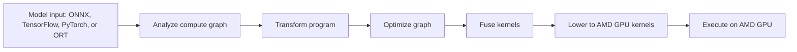
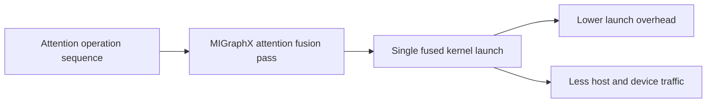

# ROCm Inference Reference

This source disposition reference was compiled from sources retrieved across
2026-04-22, 2026-05-24, and the Quark/AWQ/GPTQ/bitsandbytes/xFormers/FBGEMM
candidate triage on 2026-05-26. It is for troubleshooting and planning the
Strix Halo `gfx1151` inference stack. Upstream ROCm documents often describe
MI300X, MI350X, CDNA, or Instinct systems; treat those details as
`advisory-only` until a local scenario validates them here.

Status labels:

- `validated`: a local host run or package result proves the behavior.
- `planned`: the repo has enough signal to create package or scenario work.
- `advisory-only`: keep the source for future reasoning, but do not act yet.
- `requires-host-validation`: package or scenario work may be useful, but no
  local result exists.

## Source Disposition

| Source | Source type | Retrieved | Validation status | Ingestion destination | Next gate | Notes |
| --- | --- | --- | --- | --- | --- | --- |
| <https://github.com/ROCm/rocm-examples/tree/amd-staging> | upstream GitHub tree, `amd-staging` | 2026-04-22 | `planned` | `docs/maintainers/rocm-inference-reference.md`; `docs/backlog.md` | pick a concrete package or scenario experiment | Wide reference for HIP, MIGraphX, hipBLASLt, Composable Kernel, rocWMMA, rocProfiler, decode, and preprocessing examples. |
| <https://github.com/ROCm/rocm-examples/tree/amd-staging/AI/MIGraphX/Quantization> | upstream GitHub tree, `amd-staging` | 2026-04-22 | `planned` | `docs/backlog.md`; `docs/maintainers/rocm-inference-reference.md` | Torch-MIGraphX source audit | PT2E quantization examples route PyTorch-exported graphs through Torch-MIGraphX and MIGraphX. |
| <https://github.com/ROCm/rocm-examples/blob/amd-staging/AI/MIGraphX/Quantization/Running-Quantized-ResNet50-via-MIGraphX.md> | upstream GitHub doc, `amd-staging` | 2026-04-22 | `requires-host-validation` | `docs/backlog.md`; `docs/maintainers/rocm-inference-reference.md` | ResNet50 PT2E smoke after package exists | Uses `capture_pre_autograd_graph`, `MGXQuantizer`, calibration, `convert_pt2e`, and `torch.compile(..., backend="migraphx")`; not LLM/vLLM proof. |
| <https://github.com/ROCm/torch_migraphx/> | upstream GitHub repo | 2026-04-22 | `validated` | `packages/python-torch-migraphx-gfx1151`; `inference/scenarios/torch-migraphx.toml`; `docs/backlog.md`; `docs/maintainers/rocm-inference-reference.md` | optional full ResNet50 PT2E quantization if model/data dependencies are needed | Current upstream builds with explicit ROCm compilers. The local package carries PT2E, lazy-Dynamo, AOTAutograd preload, and numpy-metadata patches; installed FX lowering, PT2E quantizer import, bounded Dynamo ResNet-style compile, and bounded PT2E ResNet-style compile probes pass on the reference host. |
| <https://rocm.docs.amd.com/projects/AMDMIGraphX/en/latest/conceptual/deep-learning-compilation.html> | upstream ROCm docs | 2026-04-22 | `advisory-only` | `docs/maintainers/rocm-inference-reference.md` | local MIGraphX smoke before runtime claims | Concept source for graph analysis, optimization, fusion, lowering, and PyTorch/ONNX/ORT entry points. |
| <https://github.com/paudley/ai-notes/tree/main/strix-halo> | third-party GitHub notes | 2026-04-22 | `requires-host-validation` | `docs/backlog.md`; `docs/maintainers/current-state.md`; `docs/maintainers/rocm-inference-reference.md` | audit package flags against current PKGBUILDs | Candidate flag reference for `-march=native`, `-famd-opt`, `PYTORCH_ROCM_ARCH`, `ROCM_HOME`, and runtime backend knobs. |
| <https://github.com/paudley/ai-notes/blob/3f15f9f1318491c9ee03782d8b2ebd41391de118/strix-halo/QWEN3-VL-EMBED.md> | third-party GitHub note, submodule commit `3f15f9f` | 2026-05-26 | `requires-host-validation` | `docs/maintainers/blackcat-recipe-surfaces.md`; `docs/backlog.md`; `docs/maintainers/rocm-inference-reference.md` | Qwen3-VL helper and scenario lane | Advises Qwen3-VL embedding/reranking W8A16 quantization, ViT FP32 behavior, FP8 E5M2 cache behavior, and `trust_remote_code` model loading. Treat as blocked for scenario promotion until source review and host gates exist. |
| <https://github.com/AtomicBot-ai/atomic-llama-cpp-turboquant/tree/feature/turboquant-kv-cache> | third-party GitHub branch via Blackcat manifest | 2026-05-26 | `advisory-only` | `docs/maintainers/blackcat-recipe-surfaces.md`; `docs/backlog.md`; `docs/maintainers/rocm-inference-reference.md` | user decision plus source-risk review | Blackcat builds this as an evaluation-only Atomic TurboQuant llama.cpp side variant. Do not add package policy without user approval, pinned-ref and license review, package boundary, benchmark target, backend coexistence, and installed scenario gates. |
| <https://rocm.docs.amd.com/en/latest/how-to/rocm-for-ai/inference-optimization/model-quantization.html> | upstream ROCm docs | 2026-04-22 | `planned` | `docs/backlog.md`; `docs/maintainers/vllm-recipe-coverage.md`; `docs/maintainers/rocm-inference-reference.md` | add bounded quantization probes | Quark, GPTQ, bitsandbytes, FP8 KV cache, and vLLM quantization entry points. |
| <https://rocm.docs.amd.com/en/latest/how-to/rocm-for-ai/inference-optimization/model-acceleration-libraries.html> | upstream ROCm docs | 2026-04-22 | `validated` | `docs/backlog.md`; `docs/maintainers/rocm-inference-reference.md`; `packages/python-flash-attn-rocm-gfx1151` | installed-engine backend-selection probe for FlashAttention Triton; source audit for remaining candidates | FlashAttention Triton has local package build, installed import/backend-selection proof, and bounded installed GPU smoke. xFormers, TunableOp, and FBGEMM remain package candidates. |
| <https://rocm.docs.amd.com/en/latest/how-to/rocm-for-ai/inference-optimization/optimizing-with-composable-kernel.html> | upstream ROCm docs | 2026-04-22 | `advisory-only` | `docs/maintainers/rocm-inference-reference.md` | measured CK bottleneck or package experiment | CK GEMM, batched GEMM, fusion hooks, SmoothQuant INT8 wrappers, and tuning dimensions. |
| <https://rocm.docs.amd.com/en/latest/how-to/rocm-for-ai/inference-optimization/optimizing-triton-kernel.html> | upstream ROCm docs | 2026-04-22 | `advisory-only` | `docs/maintainers/rocm-inference-reference.md` | targeted Triton kernel experiment | Triton and TorchInductor knobs such as block sizes, `waves_per_eu`, `matrix_instr_nonkdim`, and max-autotune. |
| <https://rocm.docs.amd.com/en/latest/how-to/rocm-for-ai/inference-optimization/profiling-and-debugging.html> | upstream ROCm docs | 2026-04-22 | `planned` | `docs/maintainers/rocm-inference-reference.md`; future troubleshooting docs | measured GPU fault or performance issue | PyTorch Profiler, `rocprof`, ROCProfiler SDK, ROCm Compute Profiler, ROCm Systems Profiler, and ROCR Debug Agent. |
| <https://rocm.docs.amd.com/en/latest/how-to/rocm-for-ai/inference-optimization/workload.html> | upstream ROCm docs | 2026-04-22 | `advisory-only` | `docs/maintainers/rocm-inference-reference.md` | measured bottleneck before tuning task | Measure-profile-tune loop, TorchInductor knobs, CK backend notes, hipBLASLt/TensileLite tuning, and MIOpen find modes. |
| <https://rocm.docs.amd.com/en/latest/how-to/rocm-for-ai/inference-optimization/vllm-optimization.html> | upstream ROCm docs | 2026-04-22 | `planned` | `docs/backlog.md`; `docs/maintainers/vllm-recipe-coverage.md`; `docs/maintainers/rocm-inference-reference.md` | bounded vLLM probes with local host results | AITER switches, `--max-num-seqs`, `--max-num-batched-tokens 8192`, default `--gpu-memory-utilization 0.9`, up to `0.95`, FP8 KV cache, Quark, AWQ, GPTQ, and speculative decode guidance. |
| <https://github.com/ROCm/flash-attention> | upstream GitHub repo | 2026-04-22 | `validated` | `packages/python-flash-attn-rocm-gfx1151`; `docs/backlog.md`; `docs/maintainers/rocm-inference-reference.md` | installed-engine backend-selection probe | ROCm FlashAttention Triton builds and installs locally with `FLASH_ATTENTION_TRITON_AMD_ENABLE=TRUE` and `GPU_ARCHS=gfx1151`; the installed package selects AITER's Triton AMD backend and passes a bounded direct GPU smoke. CK and autotune remain later experiments. |
| <https://github.com/Dao-AILab/flash-attention/issues/1579> | upstream GitHub issue | 2026-04-24 | `advisory-only` | `docs/maintainers/flashattention-ck-paged-kv.md`; `docs/backlog.md`; `docs/maintainers/current-state.md` | direct CK 64-page reproducer | Tracks the unresolved question of smaller ROCm CK paged-KV block sizes for vLLM V1. Keep this as a tabled kernel avenue until local reference-match tests justify reopening it. |
| <https://github.com/OpenNMT/CTranslate2/tree/v4.7.2> | upstream GitHub tag | 2026-05-24 | `validated` | `packages/ctranslate2-gfx1151`; `docs/backlog.md`; `docs/maintainers/rocm-inference-reference.md` | install, Python import, and Open WebUI/faster-whisper STT smoke | Tagged OpenNMT 4.7.2 includes first-party `WITH_HIP=ON` build support. The local package build completed for both split packages when CMake used ROCm clang directly as the HIP compiler, the optional CLI target was disabled, the exact pybind11 build requirement was relaxed, and package Python calls used `/usr/bin/python`. The installed Open WebUI STT path selected `DEVICE_TYPE=cuda` and produced non-empty transcript text through faster-whisper. |
| <https://github.com/ROCm/CTranslate2/tree/amd_dev> | ROCm GitHub fork branch | 2026-05-24 | `advisory-only` | `packages/ctranslate2-gfx1151`; `docs/maintainers/rocm-inference-reference.md` | compare only when fork-specific HIP fixes are needed | The branch contains ROCm-oriented Docker and HIP carry, but the current local package source should stay on the tagged OpenNMT release because OpenNMT 4.7.2 already carries HIP build support. |
| <https://rocm.blogs.amd.com/artificial-intelligence/ctranslate2/README.html> | AMD ROCm blog | 2026-05-24 | `advisory-only` | `packages/ctranslate2-gfx1151`; `docs/maintainers/rocm-inference-reference.md` | local Open WebUI/faster-whisper STT smoke | Describes CTranslate2 on AMD GPUs using ROCm, PyTorch, and `device="cuda"` examples. Treat performance and model examples as advisory, while the local Open WebUI/faster-whisper validation is now the gfx1151 acceptance proof. |
| <https://github.com/amd/Quark> | upstream AMD GitHub repo, `release/0.11` at `210bbb76a1af71d6e5e03f8bea4d3bcf4ef57178`; latest public tag `v0.11.1`; PyPI latest `amd-quark 0.11.2` | 2026-05-26 | `requires-host-validation` | `docs/backlog.md`; `docs/maintainers/vllm-recipe-coverage.md`; `docs/maintainers/rocm-inference-reference.md` | Pin a Quark-exported model artifact and run a bounded vLLM consumer smoke; separately choose a package source pin and resolve Python/NumPy compatibility before authoring-tool packaging | Split Quark into a vLLM consumer lane and an optional authoring-tool package lane. vLLM consumes exported Hugging Face-format artifacts with `quantization="quark"`; `amd-quark` is needed for authoring/quantization, not as a local vLLM runtime dependency. As of the 2026-05-26 refresh, PyPI `0.11.2` publishes only a wheel, no matching public `v0.11.2` tag or sdist was observed, and the PyPI metadata declares `<3.13` Python plus `numpy<=2.1.3`. |
| <https://docs.vllm.ai/en/latest/features/quantization/> | upstream vLLM docs | 2026-05-26 | `requires-host-validation` | `docs/backlog.md`; `docs/maintainers/vllm-recipe-coverage.md`; `docs/maintainers/rocm-inference-reference.md` | reconcile support matrix with local gfx1151 scenarios | The visible support matrix marks Quark and FBGEMM FP8 as AMD-GPU-supported and marks AWQ, GPTQ, and BitsAndBytes unsupported on AMD GPU. vLLM ROCm platform APIs and AMD ROCm docs expose narrower AWQ/GPTQ hooks, so local scenario results decide promotion. |
| <https://huggingface.co/RafaDom/Qwen3.5-4B-Claude-4.6-Opus-Reasoning-Distilled-v2-GPTQ-Int4-HQ> | Hugging Face model repo, revision `a86e57f8166807d28b447bab5daad3e079a268a7` | 2026-05-26 | `requires-host-validation` | `inference/scenarios/vllm-qwen.toml`; `docs/backlog.md`; `docs/maintainers/vllm-recipe-coverage.md` | operator provenance/terms decision or fixture replacement before installed gfx1151 run | Retained Qwen3.5 GPTQ Int4 safetensors fixture with `apache-2.0` license metadata, base model `Jackrong/Qwen3.5-9B-Claude-4.6-Opus-Reasoning-Distilled-v2`, and `quant_method: gptq`. The scenario metadata pins the revision and license. The model name and base-model metadata assert Claude-derived distillation, which the license metadata does not resolve; do not promote it as a first-class live fixture until provenance/terms risk is explicitly accepted or the fixture is replaced. Treat model config, tokenizer, template, and weights as untrusted inputs until live-validated. |
| <https://github.com/bitsandbytes-foundation/bitsandbytes/releases/tag/0.49.2> | upstream GitHub release, commit `f0e6ca31b32c4744a9cee4e31610b25796cbf778` | 2026-05-26 | `requires-host-validation` | `docs/backlog.md`; `docs/maintainers/rocm-inference-reference.md` | source-built `python-bitsandbytes-gfx1151` package experiment plus PyTorch/vLLM smokes | ROCm support is official but preview; upstream docs list `gfx1151` in ROCm target sets and expose `COMPUTE_BACKEND=hip` / `BNB_ROCM_ARCH`. Do not adopt PyPI binary wheels; build from pinned source and keep the package separate from `python-vllm-rocm-gfx1151`. |
| <https://github.com/facebookresearch/xformers> | upstream Meta GitHub repo, latest release `v0.0.35` at `03b91d7d9ff295ae68a320e2e733dd6c2ef8f342` | 2026-05-26 | `requires-host-validation` | `docs/backlog.md`; `docs/maintainers/rocm-inference-reference.md` | source-built xFormers package experiment only after a concrete consumer exists | Mature upstream package, but ROCm/gfx1151 relevance is unproven. Public wheels are not package sources for this stack; a local package would need pinned submodules, `gfx1151` HIP build proof, extension linkage checks, and direct attention correctness smokes. |
| <https://github.com/ROCm/xformers> | ROCm GitHub fork, `develop` at `db55a2f5745ee0a13316f93e968a002b143e35da` | 2026-05-26 | `advisory-only` | `docs/backlog.md`; `docs/maintainers/rocm-inference-reference.md` | compare only if Meta upstream lacks required ROCm carry | ROCm fork has no public releases observed and examples/docs target MI300-class `gfx942`; use as advisory source only unless a future package audit proves it is the right source lane. |
| <https://github.com/pytorch/FBGEMM/releases/tag/v1.7.0> | upstream PyTorch/Meta GitHub release, commit `bf6dce360a4fe133bc779e2fd036277678509f95` | 2026-05-26 | `requires-host-validation` | `docs/backlog.md`; `docs/maintainers/rocm-inference-reference.md` | source-built FBGEMM package experiment with proven consumer path | Real ROCm support exists, including ROCm 7.x release notes and FBGEMM FP8 matrix support in vLLM, but visible CI and examples target CDNA/MI300-class `gfx942`. Track separately from PyTorch; require source/submodule pinning, package-boundary decision, import/op smoke, and a vLLM or Transformers consumer path before adoption. |

## Package And Scenario Impact

- `ctranslate2-gfx1151` and `python-ctranslate2-gfx1151` are the local
  ROCm/HIP CTranslate2 closure for Open WebUI's `faster-whisper` STT path. The
  package uses OpenNMT 4.7.2 with `WITH_HIP=ON`, not the CPU-only AUR build
  shape and not the ROCm fork as the primary source lane.
- `migraphx-gfx1151` is the local TheRock split for MIGraphX. Do not add a
  duplicate MIGraphX package. The split policy maps real MIGraphX binaries,
  shared libraries, private headers, and Python `migraphx*` modules to this
  package, and the rendered package installs `migraphx.pth` so Python can
  import `/opt/rocm/lib` modules.
- `python-torch-migraphx-gfx1151` now has package policy, build proof, and
  installed host proof for the audited upstream commit that reports version
  `1.2`. Current upstream Torch-MIGraphX builds as a Python 3.14 wheel with
  explicit ROCm compiler bindings. The reference host imports the MIGraphX
  Python module from `migraphx-gfx1151`, lowers a tiny module through FX, and
  runs the same module through `torch.compile(..., backend="migraphx")` from
  the installed `1.2-3` package. The installed `1.2-4` package adds PT2E
  quantizer compatibility and passes bounded ResNet-style Dynamo and PT2E
  compile probes.
- Keep a full ResNet50 PT2E quantization flow as optional follow-up if its
  model/data dependencies are needed.
- Treat ROCm FlashAttention as two experiments:
  - FlashAttention CK: import/build smoke first, then direct CK tests.
    The Qwen3.5 vLLM consumer unlock attempt is tabled in
    `docs/maintainers/flashattention-ck-paged-kv.md`; it needs direct CK
    64-page correctness proof or upstream kernel repair before promotion.
  - FlashAttention Triton: `python-flash-attn-rocm-gfx1151` now has package
    build proof, installed runtime backend-selection proof, and a bounded
    direct installed smoke; the remaining gate is an installed-engine
    backend-selection probe.
- Track Quark, AWQ, GPTQ, bitsandbytes, FP8 KV-cache, and AITER feature
  switches as vLLM scenario candidates. Keep the existing Qwen3.6 FP8 MoE
  blockers until a backend advertises gfx1151 support and a local run passes.
- The 2026-05-26 candidate triage ranks GPTQ first because the repo retains a
  Qwen3.5 GPTQ Int4 safetensors scenario with pinned revision and license
  metadata. Promote it only after the operator accepts the provenance/terms
  risk or replaces the fixture, an installed gfx1151 run passes, and source,
  install, and live-scenario states are recorded separately.
- Track AWQ as exploratory and keep native AWQ, compressed-tensors AWQ-format
  models, and deprecated AutoAWQ tooling separate. Do not package AutoAWQ for
  this lane.
- Track Quark as two lanes. The vLLM consumer lane needs a pinned
  Quark-exported model artifact, model provenance/terms review, and a bounded
  installed vLLM smoke with `quantization="quark"`; no new package build is
  expected unless the existing vLLM runtime base changes. The optional
  `amd-quark` authoring-tool package lane needs an explicit source pin for the
  chosen release, Python 3.14 and current NumPy compatibility resolution,
  source verification, package build, deploy/install handoff, installed import
  or CLI smoke, Quark-exported model production, and a downstream vLLM consumer
  smoke. Do not make `amd-quark` a `python-vllm-rocm-gfx1151` runtime
  dependency.
- Track bitsandbytes as a source-built package candidate. The source audit
  found official preview ROCm/gfx1151 support, but adoption requires a local
  `COMPUTE_BACKEND=hip` build, installed PyTorch smokes, and bounded
  Transformers/vLLM quantization smokes. Do not consume prebuilt wheels as the
  package source.
- Keep xFormers and FBGEMM as package candidates, not package commitments.
  xFormers needs explicit `gfx1151` source-build and direct attention proof
  before a consumer scenario; FBGEMM needs a package-boundary decision, source
  and submodule pins, import/op proof, and a vLLM or Transformers consumer path.
- Keep the Blackcat Qwen3-VL embedding/reranking notes as blocked scenario
  material until the repo owns source-reviewed vLLM patches, bounded model
  bindings, and host validation. The existing llmcompressor and
  compressed-tensors packages are tooling-helper package coverage, not proof
  that Qwen3-VL runtime behavior is validated.
- Keep Atomic TurboQuant as a blocked package candidate. Its branch is an
  evaluation side variant, so adoption requires user judgment, a pinned source
  ref, license/provenance review, package-boundary design, benchmark target,
  coexistence with the maintained llama.cpp backends, and installed scenario
  gates.

## MIGraphX Compilation Flow

```mermaid
flowchart LR
  A[Model input: ONNX, TensorFlow, PyTorch, or ORT] --> B[Analyze compute graph]
  B --> C[Transform program]
  C --> D[Optimize graph]
  D --> E[Fuse kernels]
  E --> F[Lower to AMD GPU kernels]
  F --> G[Execute on AMD GPU]
```

## Attention Fusion

```mermaid
flowchart LR
  A[Attention operation sequence] --> B[MIGraphX attention fusion pass]
  B --> C[Single fused kernel launch]
  C --> D[Lower launch overhead]
  C --> E[Less host and device traffic]
```

## Existing Failure Audit

- Qwen3.6 FP8 MoE remains blocked. The ROCm vLLM optimization document adds
  adjacent FP8 KV-cache, Quark, AWQ, GPTQ, and AITER probes, but the current
  `No FP8 MoE backend supports the deployment configuration` and
  `unknown type name 'mfma_adaptor'` failures remain unresolved.
- Gemma 4 AITER FlashAttention remains blocked until the backend gate changes.
  ROCm FlashAttention references inform a standalone package experiment, not
  the existing `ROCM_AITER_FA` failure.
- MIGraphX and Torch-MIGraphX create a compiled graph/quantization lane. They
  do not replace vLLM backend support for long-context LLM serving.
- No affected tracked failure found for profiler-only references. Keep those
  as troubleshooting material until a measured fault or bottleneck appears.
